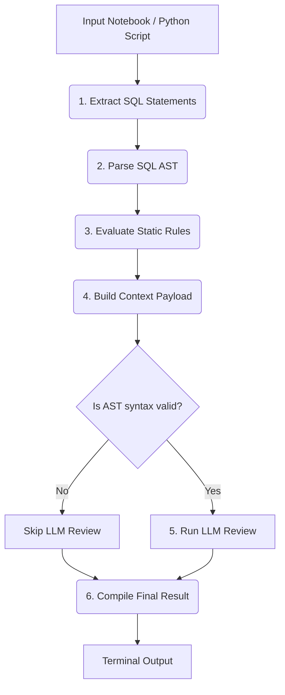

# Databricks SQL Code Review Agent

An automated SQL Code Review Agent built using **LangGraph**, **sqlglot**, and **Gemini LLM** to enforce SQL coding standards, verify syntactical correctness (AST parsing), and check identifier formatting standards for Databricks SQL notebooks (`.ipynb`) and standalone Python scripts (`.py`).

---

## 🛠️ LangGraph Workflow Architecture

The code review process runs as a state machine using LangGraph:



### SQL Extraction Strategy
- **SQL Notebook Cells**: Extracts queries from `%sql` code cells or default SQL cells.
- **PySpark Code (Python Files & Cells)**: Analyzes the Abstract Syntax Tree (AST) of the Python code using the standard `ast` module to detect and extract SQL queries passed to `spark.sql(...)` calls. Handles static strings, f-strings (substituting dynamic values with wildcards), and local variable references.

---

## ⚙️ Active Coding Rules

1. **RULE-001 (Keyword Uppercase)**: All SQL DDL/DML keywords (e.g. `SELECT`, `FROM`, `WHERE`, `USE`, `CATALOG`, `SCHEMA`, `LEFT JOIN`, `PARTITION BY`) must be written in uppercase.
2. **RULE-002 (Descriptive Naming)**: Column aliases and table identifiers must not use cryptic short-form abbreviations (e.g. use `amount` instead of `amt`, `transaction` instead of `txn`, `customer` instead of `cust`, `quantity` instead of `qty`, `date` instead of `dt`).

---

## 🚀 Setup & Local Execution

### 1. Prerequisites
- Python 3.10+
- A Gemini API Key from Google AI Studio.
- A GitHub Personal Access Token (PAT) (only if testing webhook PR integrations).

### 2. Installation
Clone the repository and set up a virtual environment:
```bash
git clone https://github.com/kp-1507/PR_Reviewer.git
cd PR_Reviewer
python3 -m venv venv
source venv/bin/activate
pip install -r requirements.txt
```

### 3. Environment Variables
Create a `.env` file in the root directory:
```env
GEMINI_API_KEY=your_gemini_api_key_here
GITHUB_TOKEN=your_github_pat_token_here
```

### 4. Running Locally (CLI Mode)
To review a local Databricks notebook or PySpark script:
```bash
# Run on the default sample notebook
python3 cli.py

# Run on a custom local notebook (.ipynb)
python3 cli.py path/to/your/notebook.ipynb

# Run on a custom local python script (.py)
python3 cli.py path/to/your/script.py
```

---

## 🌐 Running via GitHub Webhooks (PR Mode)

To run the reviewer automatically whenever a Pull Request is opened or updated:

### 1. Start your local server
```bash
uvicorn main:app --reload --port 8000
```

### 2. Expose the port using ngrok
In a separate terminal, launch `ngrok`:
```bash
ngrok http 8000
```
Copy the forwarding HTTPS URL (e.g., `https://xxxx.ngrok-free.app`).

### 3. Register the Webhook in GitHub
1. Go to your target GitHub repository **Settings** > **Webhooks** > **Add webhook**.
2. **Payload URL**: Append `/webhook/github` to your ngrok URL (e.g. `https://xxxx.ngrok-free.app/webhook/github`).
3. **Content type**: `application/json`
4. **Trigger events**: Select **Let me select individual events** -> check **Pull requests**.
5. Click **Add webhook**.

Whenever a PR is opened or updated, the webhook will fire, and your local server will instantly process the notebook files in the background and print the clean error highlights directly in your uvicorn console!